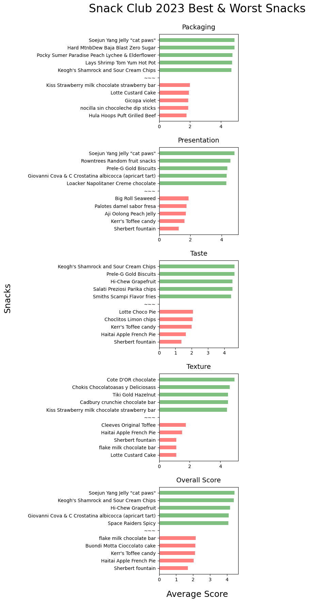

# Snack Club 2023 Wrapped Data Analysis
Snack Club is four friends getting together ~once a week to rate snacks. This the is (first ever) data analysis of snack scores given in 2023. 

Snacks are from subscription service, [Snack Crate](https://www.snackcrate.com/). 

The goofy presentation for a subset of these results can be found [here (Google Drive link)](https://docs.google.com/presentation/d/1ymt2Gg3I-l3x6Hns0eWbP5eVIhWxiU42Tw-eds5HK9U/edit?usp=sharing).


```python
import glob
data_files = glob.glob("./input/*.csv")
data_files
```


    ['./input/2023 data pre-processing - J.csv',
     './input/2023 data pre-processing - E.csv',
     './input/2023 data pre-processing - C.csv',
     './input/2023 data pre-processing - A.csv']


```python
import pandas as pd
pd.set_option('display.precision', 2)

df_list = []
for fn in data_files:
    df = pd.read_csv(fn)
    df['Member'] = fn[-5]
    df_list.append(df)
df = pd.concat(df_list)
df['Date'] = pd.to_datetime(df['Date'], format='%m/%d/%Y')
df = df.sort_values(['Date', 'Country'])
df = df.set_index(['Date','Country','Snack','Member'])
```


```python
# Identify missing scores
import numpy as np
print('Any null values?')
display(df[df.isna().any(axis=1)])
print('Any non-numeric values?')
display(df[~df.applymap(np.isreal).any(axis=1)])
```

    Any null values?


<div>
<style scoped>
    .dataframe tbody tr th:only-of-type {
        vertical-align: middle;
    }

    .dataframe tbody tr th {
        vertical-align: top;
    }

    .dataframe thead th {
        text-align: right;
    }
</style>
<table border="1" class="dataframe">
  <thead>
    <tr style="text-align: right;">
      <th></th>
      <th></th>
      <th></th>
      <th></th>
      <th>Packaging</th>
      <th>Presentation</th>
      <th>Taste</th>
      <th>Texture</th>
    </tr>
    <tr>
      <th>Date</th>
      <th>Country</th>
      <th>Snack</th>
      <th>Member</th>
      <th></th>
      <th></th>
      <th></th>
      <th></th>
    </tr>
  </thead>
  <tbody>
  </tbody>
</table>
</div>


    Any non-numeric values?


<div>
<style scoped>
    .dataframe tbody tr th:only-of-type {
        vertical-align: middle;
    }

    .dataframe tbody tr th {
        vertical-align: top;
    }

    .dataframe thead th {
        text-align: right;
    }
</style>
<table border="1" class="dataframe">
  <thead>
    <tr style="text-align: right;">
      <th></th>
      <th></th>
      <th></th>
      <th></th>
      <th>Packaging</th>
      <th>Presentation</th>
      <th>Taste</th>
      <th>Texture</th>
    </tr>
    <tr>
      <th>Date</th>
      <th>Country</th>
      <th>Snack</th>
      <th>Member</th>
      <th></th>
      <th></th>
      <th></th>
      <th></th>
    </tr>
  </thead>
  <tbody>
  </tbody>
</table>
</div>


## Stats


```python
# Overall Score
df['Overall Score'] = df.mean(axis=1)
df.to_csv('2023_snack_club_scores.csv')
```

## Overall Scores


```python
# Stats overall
print('2023 Snack Club Statistics!')
print('Snacks rated:', df.reset_index()['Snack'].value_counts().count())
print('Countries / snack crates #:', df.reset_index()['Country'].value_counts().count())
print('Countries / snack crates:', df.reset_index()['Country'].value_counts().index.values)
print('Snack scores, total given:', df.count().sum())
```

    2023 Snack Club Statistics!
    Snacks rated: 147
    Countries / snack crates #: 14
    Countries / snack crates: ['Thailand' 'Colombia' 'United Kingdom' 'Italy' 'Greece' 'Belgium'
     'Ireland' 'India' 'China' 'Korea' 'Spain' 'Canada'
     'America-Vegas-Special' 'Caribbean']
    Snack scores, total given: 2940


## By Member


```python
# display(df.agg(['idxmax','idxmin']))
idx = pd.IndexSlice
# Stats Members
display('*************************************')
display('Stats by Member')
df_stats_members = df.groupby(['Member']).agg(['min','max','mean','median','std','idxmax','idxmin'])
display(df_stats_members.loc[:, idx[:, ['min','max']]])
display(df_stats_members.loc[:, idx[:, ['mean','median','std']]])
# display(df_stats_members.loc[:, idx[:, ['idxmax','idxmin']]])
display(df_stats_members.loc[:, idx[:, ['mean']]].agg(['idxmax','idxmin']))
display(df_stats_members.loc[:, idx[:, ['std']]].agg(['idxmax','idxmin']))
```


    '*************************************'


    'Stats by Member'


<div>
<style scoped>
    .dataframe tbody tr th:only-of-type {
        vertical-align: middle;
    }

    .dataframe tbody tr th {
        vertical-align: top;
    }

    .dataframe thead tr th {
        text-align: left;
    }

    .dataframe thead tr:last-of-type th {
        text-align: right;
    }
</style>
<table border="1" class="dataframe">
  <thead>
    <tr>
      <th></th>
      <th colspan="2" halign="left">Packaging</th>
      <th colspan="2" halign="left">Presentation</th>
      <th colspan="2" halign="left">Taste</th>
      <th colspan="2" halign="left">Texture</th>
      <th colspan="2" halign="left">Overall Score</th>
    </tr>
    <tr>
      <th></th>
      <th>min</th>
      <th>max</th>
      <th>min</th>
      <th>max</th>
      <th>min</th>
      <th>max</th>
      <th>min</th>
      <th>max</th>
      <th>min</th>
      <th>max</th>
    </tr>
    <tr>
      <th>Member</th>
      <th></th>
      <th></th>
      <th></th>
      <th></th>
      <th></th>
      <th></th>
      <th></th>
      <th></th>
      <th></th>
      <th></th>
    </tr>
  </thead>
  <tbody>
    <tr>
      <th>A</th>
      <td>1.75</td>
      <td>5.0</td>
      <td>1.5</td>
      <td>4.8</td>
      <td>1.5</td>
      <td>4.75</td>
      <td>1.0</td>
      <td>5.0</td>
      <td>1.75</td>
      <td>4.55</td>
    </tr>
    <tr>
      <th>C</th>
      <td>1.50</td>
      <td>5.0</td>
      <td>1.5</td>
      <td>5.0</td>
      <td>1.0</td>
      <td>4.50</td>
      <td>1.0</td>
      <td>5.0</td>
      <td>1.88</td>
      <td>4.50</td>
    </tr>
    <tr>
      <th>E</th>
      <td>1.50</td>
      <td>5.0</td>
      <td>1.0</td>
      <td>5.0</td>
      <td>1.2</td>
      <td>5.00</td>
      <td>1.0</td>
      <td>4.7</td>
      <td>1.62</td>
      <td>4.45</td>
    </tr>
    <tr>
      <th>J</th>
      <td>1.50</td>
      <td>5.0</td>
      <td>1.0</td>
      <td>5.0</td>
      <td>1.0</td>
      <td>5.00</td>
      <td>1.0</td>
      <td>5.0</td>
      <td>1.50</td>
      <td>4.62</td>
    </tr>
  </tbody>
</table>
</div>


<div>
<style scoped>
    .dataframe tbody tr th:only-of-type {
        vertical-align: middle;
    }

    .dataframe tbody tr th {
        vertical-align: top;
    }

    .dataframe thead tr th {
        text-align: left;
    }

    .dataframe thead tr:last-of-type th {
        text-align: right;
    }
</style>
<table border="1" class="dataframe">
  <thead>
    <tr>
      <th></th>
      <th colspan="3" halign="left">Packaging</th>
      <th colspan="3" halign="left">Presentation</th>
      <th colspan="3" halign="left">Taste</th>
      <th colspan="3" halign="left">Texture</th>
      <th colspan="3" halign="left">Overall Score</th>
    </tr>
    <tr>
      <th></th>
      <th>mean</th>
      <th>median</th>
      <th>std</th>
      <th>mean</th>
      <th>median</th>
      <th>std</th>
      <th>mean</th>
      <th>median</th>
      <th>std</th>
      <th>mean</th>
      <th>median</th>
      <th>std</th>
      <th>mean</th>
      <th>median</th>
      <th>std</th>
    </tr>
    <tr>
      <th>Member</th>
      <th></th>
      <th></th>
      <th></th>
      <th></th>
      <th></th>
      <th></th>
      <th></th>
      <th></th>
      <th></th>
      <th></th>
      <th></th>
      <th></th>
      <th></th>
      <th></th>
      <th></th>
    </tr>
  </thead>
  <tbody>
    <tr>
      <th>A</th>
      <td>3.32</td>
      <td>3.4</td>
      <td>0.79</td>
      <td>3.16</td>
      <td>3.0</td>
      <td>0.73</td>
      <td>3.55</td>
      <td>3.75</td>
      <td>0.74</td>
      <td>3.38</td>
      <td>3.5</td>
      <td>0.82</td>
      <td>3.35</td>
      <td>3.38</td>
      <td>0.53</td>
    </tr>
    <tr>
      <th>C</th>
      <td>3.47</td>
      <td>3.5</td>
      <td>0.73</td>
      <td>3.31</td>
      <td>3.5</td>
      <td>0.73</td>
      <td>3.48</td>
      <td>3.50</td>
      <td>0.78</td>
      <td>3.52</td>
      <td>3.5</td>
      <td>0.78</td>
      <td>3.44</td>
      <td>3.50</td>
      <td>0.50</td>
    </tr>
    <tr>
      <th>E</th>
      <td>3.26</td>
      <td>3.3</td>
      <td>0.73</td>
      <td>2.96</td>
      <td>3.0</td>
      <td>0.88</td>
      <td>3.37</td>
      <td>3.50</td>
      <td>0.83</td>
      <td>3.24</td>
      <td>3.4</td>
      <td>0.84</td>
      <td>3.21</td>
      <td>3.25</td>
      <td>0.56</td>
    </tr>
    <tr>
      <th>J</th>
      <td>3.18</td>
      <td>3.0</td>
      <td>0.84</td>
      <td>3.12</td>
      <td>3.0</td>
      <td>0.79</td>
      <td>3.14</td>
      <td>3.00</td>
      <td>0.92</td>
      <td>3.28</td>
      <td>3.5</td>
      <td>0.81</td>
      <td>3.18</td>
      <td>3.25</td>
      <td>0.56</td>
    </tr>
  </tbody>
</table>
</div>


<div>
<style scoped>
    .dataframe tbody tr th:only-of-type {
        vertical-align: middle;
    }

    .dataframe tbody tr th {
        vertical-align: top;
    }

    .dataframe thead tr th {
        text-align: left;
    }
</style>
<table border="1" class="dataframe">
  <thead>
    <tr>
      <th></th>
      <th>Packaging</th>
      <th>Presentation</th>
      <th>Taste</th>
      <th>Texture</th>
      <th>Overall Score</th>
    </tr>
    <tr>
      <th></th>
      <th>mean</th>
      <th>mean</th>
      <th>mean</th>
      <th>mean</th>
      <th>mean</th>
    </tr>
  </thead>
  <tbody>
    <tr>
      <th>idxmax</th>
      <td>C</td>
      <td>C</td>
      <td>A</td>
      <td>C</td>
      <td>C</td>
    </tr>
    <tr>
      <th>idxmin</th>
      <td>J</td>
      <td>E</td>
      <td>J</td>
      <td>E</td>
      <td>J</td>
    </tr>
  </tbody>
</table>
</div>


<div>
<style scoped>
    .dataframe tbody tr th:only-of-type {
        vertical-align: middle;
    }

    .dataframe tbody tr th {
        vertical-align: top;
    }

    .dataframe thead tr th {
        text-align: left;
    }
</style>
<table border="1" class="dataframe">
  <thead>
    <tr>
      <th></th>
      <th>Packaging</th>
      <th>Presentation</th>
      <th>Taste</th>
      <th>Texture</th>
      <th>Overall Score</th>
    </tr>
    <tr>
      <th></th>
      <th>std</th>
      <th>std</th>
      <th>std</th>
      <th>std</th>
      <th>std</th>
    </tr>
  </thead>
  <tbody>
    <tr>
      <th>idxmax</th>
      <td>J</td>
      <td>E</td>
      <td>J</td>
      <td>E</td>
      <td>J</td>
    </tr>
    <tr>
      <th>idxmin</th>
      <td>E</td>
      <td>C</td>
      <td>A</td>
      <td>C</td>
      <td>C</td>
    </tr>
  </tbody>
</table>
</div>


## By Snack

### Top snacks by category, overall


```python
# # Stats Snacks
display('Stats by Snack')
df_stats_snacks = df.groupby(['Snack']).agg(['min','max','mean','median','std'])
idx = pd.IndexSlice
df_ss_mean = df_stats_snacks.loc[:, idx[:, ['mean']]].droplevel(level=1,axis='columns').sort_values(by=['Taste','Overall Score','Texture'],ascending=False)
display(df_ss_mean)
display('*************************************')
df_ss_mm = df_stats_snacks.loc[:, idx[:, ['mean','median','std']]]
display(df_ss_mm.agg(['idxmax','idxmin'])) # only returns first instance
```


    'Stats by Snack'


<div>
<style scoped>
    .dataframe tbody tr th:only-of-type {
        vertical-align: middle;
    }

    .dataframe tbody tr th {
        vertical-align: top;
    }

    .dataframe thead th {
        text-align: right;
    }
</style>
<table border="1" class="dataframe">
  <thead>
    <tr style="text-align: right;">
      <th></th>
      <th>Packaging</th>
      <th>Presentation</th>
      <th>Taste</th>
      <th>Texture</th>
      <th>Overall Score</th>
    </tr>
    <tr>
      <th>Snack</th>
      <th></th>
      <th></th>
      <th></th>
      <th></th>
      <th></th>
    </tr>
  </thead>
  <tbody>
    <tr>
      <th>Keogh's Shamrock and Sour Cream Chips</th>
      <td>4.69</td>
      <td>4.20</td>
      <td>4.62</td>
      <td>4.05</td>
      <td>4.39</td>
    </tr>
    <tr>
      <th>Prele-G Gold Biscuits</th>
      <td>2.25</td>
      <td>4.38</td>
      <td>4.62</td>
      <td>4.00</td>
      <td>3.81</td>
    </tr>
    <tr>
      <th>Hi-Chew Grapefruit</th>
      <td>4.40</td>
      <td>3.70</td>
      <td>4.50</td>
      <td>4.14</td>
      <td>4.18</td>
    </tr>
    <tr>
      <th>Salati Preziosi Parika chips</th>
      <td>3.92</td>
      <td>3.25</td>
      <td>4.50</td>
      <td>3.50</td>
      <td>3.79</td>
    </tr>
    <tr>
      <th>Smiths Scampi Flavor fries</th>
      <td>2.75</td>
      <td>4.06</td>
      <td>4.42</td>
      <td>4.00</td>
      <td>3.81</td>
    </tr>
    <tr>
      <th>...</th>
      <td>...</td>
      <td>...</td>
      <td>...</td>
      <td>...</td>
      <td>...</td>
    </tr>
    <tr>
      <th>Lotte Choco Pie</th>
      <td>2.42</td>
      <td>2.75</td>
      <td>2.08</td>
      <td>2.05</td>
      <td>2.33</td>
    </tr>
    <tr>
      <th>Choclitos Limon chips</th>
      <td>2.75</td>
      <td>3.20</td>
      <td>2.05</td>
      <td>3.38</td>
      <td>2.84</td>
    </tr>
    <tr>
      <th>Kerr's Toffee candy</th>
      <td>3.00</td>
      <td>1.62</td>
      <td>2.00</td>
      <td>1.82</td>
      <td>2.11</td>
    </tr>
    <tr>
      <th>Haitai Apple French Pie</th>
      <td>3.12</td>
      <td>1.88</td>
      <td>1.64</td>
      <td>1.50</td>
      <td>2.03</td>
    </tr>
    <tr>
      <th>Sherbert fountain</th>
      <td>3.00</td>
      <td>1.25</td>
      <td>1.38</td>
      <td>1.12</td>
      <td>1.69</td>
    </tr>
  </tbody>
</table>
<p>147 rows × 5 columns</p>
</div>


    '*************************************'


<div>
<style scoped>
    .dataframe tbody tr th:only-of-type {
        vertical-align: middle;
    }

    .dataframe tbody tr th {
        vertical-align: top;
    }

    .dataframe thead tr th {
        text-align: left;
    }
</style>
<table border="1" class="dataframe">
  <thead>
    <tr>
      <th></th>
      <th colspan="3" halign="left">Packaging</th>
      <th colspan="3" halign="left">Presentation</th>
      <th colspan="3" halign="left">Taste</th>
      <th colspan="3" halign="left">Texture</th>
      <th colspan="3" halign="left">Overall Score</th>
    </tr>
    <tr>
      <th></th>
      <th>mean</th>
      <th>median</th>
      <th>std</th>
      <th>mean</th>
      <th>median</th>
      <th>std</th>
      <th>mean</th>
      <th>median</th>
      <th>std</th>
      <th>mean</th>
      <th>median</th>
      <th>std</th>
      <th>mean</th>
      <th>median</th>
      <th>std</th>
    </tr>
  </thead>
  <tbody>
    <tr>
      <th>idxmax</th>
      <td>Hard MtnbDew Baja Blast Zero Sugar</td>
      <td>Hard MtnbDew Baja Blast Zero Sugar</td>
      <td>Chips Ahoy Cranberry</td>
      <td>Soejun Yang Jelly "cat paws"</td>
      <td>Soejun Yang Jelly "cat paws"</td>
      <td>Tronky Nocciola</td>
      <td>Keogh's Shamrock and Sour Cream Chips</td>
      <td>Keogh's Shamrock and Sour Cream Chips</td>
      <td>Big Roll Seaweed</td>
      <td>Cote D'OR chocolate</td>
      <td>Cote D'OR chocolate</td>
      <td>Millions strawberry fruit candy</td>
      <td>Soejun Yang Jelly "cat paws"</td>
      <td>Soejun Yang Jelly "cat paws"</td>
      <td>Pororo Straw Type Jelly</td>
    </tr>
    <tr>
      <th>idxmin</th>
      <td>Hula Hoops Puft Grilled Beef</td>
      <td>Hula Hoops Puft Grilled Beef</td>
      <td>Caffrey's Big Time Chocolate Caramel Bar</td>
      <td>Sherbert fountain</td>
      <td>Sherbert fountain</td>
      <td>5050 Maska Chaska</td>
      <td>Sherbert fountain</td>
      <td>Sherbert fountain</td>
      <td>Hi-Chew Grapefruit</td>
      <td>Lotte Custard Cake</td>
      <td>Lotte Custard Cake</td>
      <td>Bear Paws Pattes d'ours</td>
      <td>Sherbert fountain</td>
      <td>Sherbert fountain</td>
      <td>Koh Kae Coconut Cream Peanuts</td>
    </tr>
  </tbody>
</table>
</div>


### Plots of Best Snacks by Average Member Score & Category


```python
import matplotlib.pyplot as plt

df_mean = df_stats_snacks.loc[:, idx[:, ['mean']]]
df_mean.columns = df_mean.columns.droplevel(1)

fig, axs = plt.subplots(5,1,figsize=(3,18))
keys = [x for x in df_mean.columns] # preserves order
targets = zip(keys, axs.flatten())
fig.suptitle('Snack Club 2023 Best & Worst Snacks', fontsize=24)
fig.supylabel('Snacks',x=-1.4,ha='left', fontsize=18)
fig.supxlabel('Average Score', fontsize=18)
colors = {'Packaging':'blue',
          'Presentation':'green',
          'Taste':'red',
          'Texture':'purple',
         'Overall Score': 'cyan'}
by_label = {}
for i, (key, ax) in enumerate(targets):
    df_topfive = df_mean[key].sort_values(ascending=False)[0:5].sort_values()
    df_lowfive = df_mean[key].sort_values()[0:5].sort_values()
    df_low_top = pd.concat([df_topfive, pd.Series(['~',0]), df_lowfive])
    
    ax.set_title(f"{key}", fontsize=14,pad=10)
        
    snacks = df_lowfive.index.values
    scores = df_lowfive.values
    color = 'red'
    ax.barh(snacks, scores,
           color=color,label=key, 
           alpha=.5,height=0.5)
    
    ax.barh(['~~~'], [0],height=0.0)
    
    snacks = df_topfive.index.values
    scores = df_topfive.values
    color = 'green'
    ax.barh(snacks, scores,
           color=color,label=key, 
           alpha=.5,height=0.5)
fig.align_labels() 
fig.subplots_adjust(top=0.93,bottom=0.05,hspace = 0.3, wspace = 0.1)
fig.savefig(f'plots/sc_bestworst_snack_avg.png',bbox_inches='tight')
```


    

    


### Plots of Snack Standard Devision Scores by Member Score & Category


```python
import matplotlib.pyplot as plt

df_std = df_stats_snacks.loc[:, idx[:, ['std']]]
df_std.columns = df_std.columns.droplevel(1)

fig, axs = plt.subplots(5,1,figsize=(3,18))
keys = [x for x in df_std.columns] # preserves order
targets = zip(keys, axs.flatten())
fig.suptitle('Snack Club 2023 Lest and Most Controversial Snacks', fontsize=24)
fig.supylabel('Snacks',x=-1.4,ha='left', fontsize=18)
fig.supxlabel('Score Standard Deviation', fontsize=18)
colors = {'Packaging':'blue',
          'Presentation':'green',
          'Taste':'red',
          'Texture':'purple',
         'Overall Score': 'cyan'}
by_label = {}
for i, (key, ax) in enumerate(targets):
    df_topfive = df_std[key].sort_values(ascending=False)[0:10].sort_values()
    df_lowfive = df_std[key].sort_values()[0:10].sort_values()
    df_low_top = pd.concat([df_topfive, pd.Series(['~',0]), df_lowfive])
    
    ax.set_title(f"{key}", fontsize=14,pad=10)
        
    snacks = df_lowfive.index.values
    scores = df_lowfive.values
    color = 'red'
    ax.barh(snacks, scores,
           color=color,label=key, 
           alpha=.5,height=0.5)
    
    ax.barh(['~~~'], [0],height=0.0)
    
    snacks = df_topfive.index.values
    scores = df_topfive.values
    color = 'green'
    ax.barh(snacks, scores,
           color=color,label=key, 
           alpha=.5,height=0.5)
fig.align_labels() 
fig.subplots_adjust(top=0.93,bottom=0.05,hspace = 0.3, wspace = 0.1)
fig.savefig(f'plots/sc_bestworst_snack_std.png',bbox_inches='tight')
```


    

    


### Plots, Best Snacks by Member & Category
Save these figures to pictures because they are so large.


```python
df_stacked = df.stack().reset_index().rename(columns={'level_4':'Category',
                                        0 : 'Score'})
df_stacked = df_stacked.set_index(['Date','Country','Snack',
                                  'Member','Category'])

grouped = df_stacked.groupby(['Member','Category'],sort=False)
keys = [x for (x,y) in grouped] # preserves order
members = [k[0] for k in keys]
# categories = [k[1] for k in keys]
categories = ['Overall Score','Taste','Texture','Presentation','Packaging']

for i, memb in enumerate(members):
    fig, axs = plt.subplots(5,1,figsize=(4,24))
    targets = zip(categories, axs.flatten())
    fig.suptitle(f'Snack Club 2023 Best & Worst Snacks - Member {memb}', fontsize=24)
    fig.supylabel('Snacks',x=-0.3,ha='left', fontsize=18)
    fig.supxlabel('Score', fontsize=18)
    by_label = {}
    for j, (cat,ax) in enumerate(targets):
        idx = pd.IndexSlice
        df_f = df_stacked.loc[idx[:, :, :, memb, cat]]
        df_top = df_f['Score'].sort_values(ascending=False)[0:10].sort_values()
        df_low = df_f['Score'].sort_values()[0:10].sort_values()
        # df_low_top = pd.concat([df_top, pd.Series(['~',0]), df_low])
        # display(df_low_top)
        ax.set_title(f"{memb} - {cat}", fontsize=14,pad=10)
        snacks = [x[2] for x in df_low.index.values]
        scores = df_low.values
        color = 'red'
        ax.barh(snacks, scores,
               color=color,label=cat, 
               alpha=.5,height=0.6)

        ax.barh(['~~~'], [0],height=0.0)

        snacks = [x[2] for x in df_top.index.values]
        scores = df_top.values
        color = 'green'
        ax.barh(snacks, scores,
               color=color,label=cat, 
               alpha=.5,height=0.5)
        ax.set_xticks([1,2,3,4,5])
    fig.subplots_adjust(top=0.93,bottom=0.05,hspace = 0.3, wspace = 0.2)
    fig.savefig(f'plots/sc_bestworst_snack_{memb}.png',bbox_inches='tight')
    plt.close(fig)
```

## By Country/Crate


```python
# # Stats Country
display('*************************************')
display('Stats by Country')
df_stats_country = df.groupby(['Country']).agg(['min','max','mean','median','std'])
idx = pd.IndexSlice
# display(df_stacked.droplevel(['Member','Category','Date']).reset_index().drop(columns='Score').set_index())
df_sc = df_stats_country.loc[:, idx[:, ['mean','std']]].copy()
# better way to get count of countries? lol
c_count = df_stacked.reset_index()[['Country','Snack']].drop_duplicates().set_index(['Country']).groupby(['Country']).agg(['count'])
# df_sc[('','count')] = c_count
df_sc = pd.concat([df_sc,c_count], axis=1)

display(df_sc.sort_values(by=('Taste','mean'),ascending=False))
display(df_sc.agg(['idxmax','idxmin']))
```


    '*************************************'


    'Stats by Country'


<div>
<style scoped>
    .dataframe tbody tr th:only-of-type {
        vertical-align: middle;
    }

    .dataframe tbody tr th {
        vertical-align: top;
    }

    .dataframe thead tr th {
        text-align: left;
    }

    .dataframe thead tr:last-of-type th {
        text-align: right;
    }
</style>
<table border="1" class="dataframe">
  <thead>
    <tr>
      <th></th>
      <th colspan="2" halign="left">Packaging</th>
      <th colspan="2" halign="left">Presentation</th>
      <th colspan="2" halign="left">Taste</th>
      <th colspan="2" halign="left">Texture</th>
      <th colspan="2" halign="left">Overall Score</th>
      <th>Snack</th>
    </tr>
    <tr>
      <th></th>
      <th>mean</th>
      <th>std</th>
      <th>mean</th>
      <th>std</th>
      <th>mean</th>
      <th>std</th>
      <th>mean</th>
      <th>std</th>
      <th>mean</th>
      <th>std</th>
      <th>count</th>
    </tr>
    <tr>
      <th>Country</th>
      <th></th>
      <th></th>
      <th></th>
      <th></th>
      <th></th>
      <th></th>
      <th></th>
      <th></th>
      <th></th>
      <th></th>
      <th></th>
    </tr>
  </thead>
  <tbody>
    <tr>
      <th>Caribbean</th>
      <td>3.18</td>
      <td>0.73</td>
      <td>2.82</td>
      <td>0.42</td>
      <td>3.73</td>
      <td>0.56</td>
      <td>3.72</td>
      <td>0.58</td>
      <td>3.36</td>
      <td>0.33</td>
      <td>4</td>
    </tr>
    <tr>
      <th>Thailand</th>
      <td>3.60</td>
      <td>0.75</td>
      <td>2.86</td>
      <td>0.59</td>
      <td>3.56</td>
      <td>0.89</td>
      <td>3.42</td>
      <td>0.70</td>
      <td>3.36</td>
      <td>0.46</td>
      <td>16</td>
    </tr>
    <tr>
      <th>Belgium</th>
      <td>2.89</td>
      <td>0.75</td>
      <td>3.42</td>
      <td>0.58</td>
      <td>3.54</td>
      <td>0.80</td>
      <td>3.62</td>
      <td>0.81</td>
      <td>3.37</td>
      <td>0.46</td>
      <td>11</td>
    </tr>
    <tr>
      <th>China</th>
      <td>3.89</td>
      <td>0.57</td>
      <td>3.29</td>
      <td>0.85</td>
      <td>3.51</td>
      <td>0.76</td>
      <td>3.40</td>
      <td>0.79</td>
      <td>3.52</td>
      <td>0.54</td>
      <td>11</td>
    </tr>
    <tr>
      <th>America-Vegas-Special</th>
      <td>3.81</td>
      <td>0.85</td>
      <td>3.75</td>
      <td>0.48</td>
      <td>3.46</td>
      <td>0.80</td>
      <td>3.59</td>
      <td>0.38</td>
      <td>3.65</td>
      <td>0.30</td>
      <td>4</td>
    </tr>
    <tr>
      <th>Ireland</th>
      <td>3.45</td>
      <td>0.78</td>
      <td>3.15</td>
      <td>0.79</td>
      <td>3.45</td>
      <td>0.89</td>
      <td>3.35</td>
      <td>0.78</td>
      <td>3.35</td>
      <td>0.61</td>
      <td>11</td>
    </tr>
    <tr>
      <th>Italy</th>
      <td>3.12</td>
      <td>0.59</td>
      <td>3.25</td>
      <td>0.96</td>
      <td>3.43</td>
      <td>0.69</td>
      <td>3.45</td>
      <td>0.85</td>
      <td>3.31</td>
      <td>0.64</td>
      <td>12</td>
    </tr>
    <tr>
      <th>Spain</th>
      <td>2.83</td>
      <td>0.78</td>
      <td>3.07</td>
      <td>0.68</td>
      <td>3.39</td>
      <td>0.75</td>
      <td>3.49</td>
      <td>0.68</td>
      <td>3.19</td>
      <td>0.52</td>
      <td>10</td>
    </tr>
    <tr>
      <th>India</th>
      <td>3.11</td>
      <td>0.79</td>
      <td>2.94</td>
      <td>0.81</td>
      <td>3.38</td>
      <td>0.91</td>
      <td>3.31</td>
      <td>0.39</td>
      <td>3.19</td>
      <td>0.38</td>
      <td>11</td>
    </tr>
    <tr>
      <th>Canada</th>
      <td>3.33</td>
      <td>0.72</td>
      <td>3.39</td>
      <td>0.90</td>
      <td>3.36</td>
      <td>0.93</td>
      <td>3.22</td>
      <td>0.87</td>
      <td>3.33</td>
      <td>0.64</td>
      <td>9</td>
    </tr>
    <tr>
      <th>Colombia</th>
      <td>3.26</td>
      <td>0.60</td>
      <td>2.96</td>
      <td>0.56</td>
      <td>3.34</td>
      <td>0.69</td>
      <td>3.35</td>
      <td>0.78</td>
      <td>3.23</td>
      <td>0.40</td>
      <td>14</td>
    </tr>
    <tr>
      <th>Greece</th>
      <td>3.18</td>
      <td>0.77</td>
      <td>3.46</td>
      <td>0.56</td>
      <td>3.26</td>
      <td>0.84</td>
      <td>3.42</td>
      <td>0.67</td>
      <td>3.33</td>
      <td>0.41</td>
      <td>12</td>
    </tr>
    <tr>
      <th>Korea</th>
      <td>3.40</td>
      <td>0.89</td>
      <td>3.02</td>
      <td>1.01</td>
      <td>3.22</td>
      <td>0.86</td>
      <td>2.83</td>
      <td>1.11</td>
      <td>3.12</td>
      <td>0.78</td>
      <td>10</td>
    </tr>
    <tr>
      <th>United Kingdom</th>
      <td>3.33</td>
      <td>0.77</td>
      <td>2.91</td>
      <td>1.00</td>
      <td>2.94</td>
      <td>0.95</td>
      <td>3.07</td>
      <td>1.15</td>
      <td>3.06</td>
      <td>0.71</td>
      <td>12</td>
    </tr>
  </tbody>
</table>
</div>


<div>
<style scoped>
    .dataframe tbody tr th:only-of-type {
        vertical-align: middle;
    }

    .dataframe tbody tr th {
        vertical-align: top;
    }

    .dataframe thead tr th {
        text-align: left;
    }
</style>
<table border="1" class="dataframe">
  <thead>
    <tr>
      <th></th>
      <th colspan="2" halign="left">Packaging</th>
      <th colspan="2" halign="left">Presentation</th>
      <th colspan="2" halign="left">Taste</th>
      <th colspan="2" halign="left">Texture</th>
      <th colspan="2" halign="left">Overall Score</th>
      <th>Snack</th>
    </tr>
    <tr>
      <th></th>
      <th>mean</th>
      <th>std</th>
      <th>mean</th>
      <th>std</th>
      <th>mean</th>
      <th>std</th>
      <th>mean</th>
      <th>std</th>
      <th>mean</th>
      <th>std</th>
      <th>count</th>
    </tr>
  </thead>
  <tbody>
    <tr>
      <th>idxmax</th>
      <td>China</td>
      <td>Korea</td>
      <td>America-Vegas-Special</td>
      <td>Korea</td>
      <td>Caribbean</td>
      <td>United Kingdom</td>
      <td>Caribbean</td>
      <td>United Kingdom</td>
      <td>America-Vegas-Special</td>
      <td>Korea</td>
      <td>Thailand</td>
    </tr>
    <tr>
      <th>idxmin</th>
      <td>Spain</td>
      <td>China</td>
      <td>Caribbean</td>
      <td>Caribbean</td>
      <td>United Kingdom</td>
      <td>Caribbean</td>
      <td>Korea</td>
      <td>America-Vegas-Special</td>
      <td>United Kingdom</td>
      <td>America-Vegas-Special</td>
      <td>America-Vegas-Special</td>
    </tr>
  </tbody>
</table>
</div>


### Best/West Snack in Country/Crate


```python
df_stats_cs = df.groupby(['Country','Snack']).agg(['mean'])
idx = pd.IndexSlice
df_scs = df_stats_cs.loc[:, idx[:, ['mean']]]
display('Best Snacks By Country (Average Score)')
display(df_scs.groupby('Country').agg(['idxmax']).applymap(lambda x: x[1]).droplevel(axis='columns',level=[2,1]))
display('Worst Snacks By Country (Average Score)')
display(df_scs.groupby('Country').agg(['idxmin']).applymap(lambda x: x[1]).droplevel(axis='columns',level=[2,1]))
```


    'Best Snacks By Country (Average Score)'


<div>
<style scoped>
    .dataframe tbody tr th:only-of-type {
        vertical-align: middle;
    }

    .dataframe tbody tr th {
        vertical-align: top;
    }

    .dataframe thead th {
        text-align: right;
    }
</style>
<table border="1" class="dataframe">
  <thead>
    <tr style="text-align: right;">
      <th></th>
      <th>Packaging</th>
      <th>Presentation</th>
      <th>Taste</th>
      <th>Texture</th>
      <th>Overall Score</th>
    </tr>
    <tr>
      <th>Country</th>
      <th></th>
      <th></th>
      <th></th>
      <th></th>
      <th></th>
    </tr>
  </thead>
  <tbody>
    <tr>
      <th>America-Vegas-Special</th>
      <td>Hard MtnbDew Baja Blast Zero Sugar</td>
      <td>Hard MtnbDew Baja Blast Zero Sugar</td>
      <td>Rap Snacks Nikki Minaj Salt &amp; Vinegar &amp; Trufflesl</td>
      <td>Rap Snacks Lily Baby "All In" Flavor Salt &amp; Vi...</td>
      <td>Hard MtnbDew Baja Blast Zero Sugar</td>
    </tr>
    <tr>
      <th>Belgium</th>
      <td>Lotus Biscoff with Belgium Choclate</td>
      <td>Cote D'OR chocolate</td>
      <td>Cote D'OR chocolate</td>
      <td>Cote D'OR chocolate</td>
      <td>Cote D'OR chocolate</td>
    </tr>
    <tr>
      <th>Canada</th>
      <td>Old Dutch Ketchup Flavored Potatoe Chips</td>
      <td>KitKat Chunky (with french on it)</td>
      <td>Humpty Dumpty Ringolos BBQ Flavor</td>
      <td>Ruffles "All Dressed"</td>
      <td>Humpty Dumpty Ringolos BBQ Flavor</td>
    </tr>
    <tr>
      <th>Caribbean</th>
      <td>Ole Xtreme Rranch Tortilla Chips</td>
      <td>Ole Xtreme Rranch Tortilla Chips</td>
      <td>Tiki Gold Hazelnut</td>
      <td>Tiki Gold Hazelnut</td>
      <td>Tiki Gold Hazelnut</td>
    </tr>
    <tr>
      <th>China</th>
      <td>Orion Peach Jelly Gummies</td>
      <td>WantWant Honey Kissed Crunchy Rice Balls (bee ...</td>
      <td>Hi-Chew Grapefruit</td>
      <td>Chips Ahoy Cranberry</td>
      <td>Hi-Chew Grapefruit</td>
    </tr>
    <tr>
      <th>Colombia</th>
      <td>Jumbo Flow</td>
      <td>Jumbo Rosca</td>
      <td>Supercoco Choco Snacks</td>
      <td>Chokis Chocolatoasas y Deliciosass</td>
      <td>Jumbo Flow</td>
    </tr>
    <tr>
      <th>Greece</th>
      <td>Derby Caramel Bar</td>
      <td>Jumbo Vrikoles, cheese and tomoato</td>
      <td>Kiss Strawberry milk chocolate strawberry bar</td>
      <td>Kiss Strawberry milk chocolate strawberry bar</td>
      <td>Derby Caramel Bar</td>
    </tr>
    <tr>
      <th>India</th>
      <td>Waffy vanilla wafers</td>
      <td>Prele-G Gold Biscuits</td>
      <td>Prele-G Gold Biscuits</td>
      <td>Prele-G Gold Biscuits</td>
      <td>Prele-G Gold Biscuits</td>
    </tr>
    <tr>
      <th>Ireland</th>
      <td>Keogh's Shamrock and Sour Cream Chips</td>
      <td>Keogh's Shamrock and Sour Cream Chips</td>
      <td>Keogh's Shamrock and Sour Cream Chips</td>
      <td>Keogh's Shamrock and Sour Cream Chips</td>
      <td>Keogh's Shamrock and Sour Cream Chips</td>
    </tr>
    <tr>
      <th>Italy</th>
      <td>Salati Preziosi Parika chips</td>
      <td>Giovanni Cova &amp; C Crostatina albicocca (aprica...</td>
      <td>Salati Preziosi Parika chips</td>
      <td>Giovanni Cova &amp; C Crostatina albicocca (aprica...</td>
      <td>Giovanni Cova &amp; C Crostatina albicocca (aprica...</td>
    </tr>
    <tr>
      <th>Korea</th>
      <td>Soejun Yang Jelly "cat paws"</td>
      <td>Soejun Yang Jelly "cat paws"</td>
      <td>Soejun Yang Jelly "cat paws"</td>
      <td>Soejun Yang Jelly "cat paws"</td>
      <td>Soejun Yang Jelly "cat paws"</td>
    </tr>
    <tr>
      <th>Spain</th>
      <td>el Valle Sabor Huevo Frito Fried Egg Taste</td>
      <td>Dulcesol palmeritas</td>
      <td>Dulcesol palmeritas</td>
      <td>Dulcesol palmeritas</td>
      <td>el Valle Sabor Huevo Frito Fried Egg Taste</td>
    </tr>
    <tr>
      <th>Thailand</th>
      <td>Pocky Sumer Paradise Peach Lychee &amp; Elderflower</td>
      <td>Jack &amp; Jill Cocont Crackers</td>
      <td>Manora Fried Pumpkin Chips</td>
      <td>Jack &amp; Jill Cocont Crackers</td>
      <td>Jack &amp; Jill Cocont Crackers</td>
    </tr>
    <tr>
      <th>United Kingdom</th>
      <td>Jaffa Cakes "The Original"</td>
      <td>Rowntrees Random fruit snacks</td>
      <td>Space Raiders Spicy</td>
      <td>Cadbury crunchie chocolate bar</td>
      <td>Space Raiders Spicy</td>
    </tr>
  </tbody>
</table>
</div>


    'Worst Snacks By Country (Average Score)'


<div>
<style scoped>
    .dataframe tbody tr th:only-of-type {
        vertical-align: middle;
    }

    .dataframe tbody tr th {
        vertical-align: top;
    }

    .dataframe thead th {
        text-align: right;
    }
</style>
<table border="1" class="dataframe">
  <thead>
    <tr style="text-align: right;">
      <th></th>
      <th>Packaging</th>
      <th>Presentation</th>
      <th>Taste</th>
      <th>Texture</th>
      <th>Overall Score</th>
    </tr>
    <tr>
      <th>Country</th>
      <th></th>
      <th></th>
      <th></th>
      <th></th>
      <th></th>
    </tr>
  </thead>
  <tbody>
    <tr>
      <th>America-Vegas-Special</th>
      <td>Rap Snacks Nikki Minaj Salt &amp; Vinegar &amp; Trufflesl</td>
      <td>Rap Snacks Lily Baby "All In" Flavor Salt &amp; Vi...</td>
      <td>Rap Snacks Lily Baby "All In" Flavor Salt &amp; Vi...</td>
      <td>Hard MtnbDew Baja Blast Zero Sugar</td>
      <td>Rap Snacks Lily Baby "All In" Flavor Salt &amp; Vi...</td>
    </tr>
    <tr>
      <th>Belgium</th>
      <td>Gicopa violet</td>
      <td>Grefin(?) Eclair</td>
      <td>DeliChoc Choco'Bar</td>
      <td>DeliChoc Choco'Bar</td>
      <td>DeliChoc Choco'Bar</td>
    </tr>
    <tr>
      <th>Canada</th>
      <td>Coffee Crisp Double Double Chocolate Bar</td>
      <td>Kerr's Toffee candy</td>
      <td>Kerr's Toffee candy</td>
      <td>Kerr's Toffee candy</td>
      <td>Kerr's Toffee candy</td>
    </tr>
    <tr>
      <th>Caribbean</th>
      <td>Tiki Gold Hazelnut</td>
      <td>Jamaican Choice Spice Bun</td>
      <td>Ole Xtreme Rranch Tortilla Chips</td>
      <td>Cherry Berries</td>
      <td>Jamaican Choice Spice Bun</td>
    </tr>
    <tr>
      <th>China</th>
      <td>Oishi Orange Candy</td>
      <td>Aji Oolong Peach Jelly</td>
      <td>Oreo Oolong + Peach</td>
      <td>Aji Oolong Peach Jelly</td>
      <td>Aji Oolong Peach Jelly</td>
    </tr>
    <tr>
      <th>Colombia</th>
      <td>Chokis Chocolatoasas y Deliciosass</td>
      <td>Chokis Chocobase cookies</td>
      <td>Choclitos Limon chips</td>
      <td>Colombina Coffee Delight chewy candy</td>
      <td>Choclitos Limon chips</td>
    </tr>
    <tr>
      <th>Greece</th>
      <td>Kiss Strawberry milk chocolate strawberry bar</td>
      <td>Derby Caramel Bar</td>
      <td>Keraso Pitaki cherry pie</td>
      <td>Keraso Pitaki cherry pie</td>
      <td>Keraso Pitaki cherry pie</td>
    </tr>
    <tr>
      <th>India</th>
      <td>5050 Maska Chaska</td>
      <td>Rola-a-cola "The solid cola"</td>
      <td>Treat Burst Choco Fills</td>
      <td>Cheetos Masala Balls</td>
      <td>Treat Burst Choco Fills</td>
    </tr>
    <tr>
      <th>Ireland</th>
      <td>Cadbury Snack! shortcake</td>
      <td>Burts Guinness Thick Cut Hand Cooked Potato Chips</td>
      <td>Caffrey's Big Time Chocolate Caramel Bar</td>
      <td>Cleeves Original Toffee</td>
      <td>Cleeves Original Toffee</td>
    </tr>
    <tr>
      <th>Italy</th>
      <td>Buondi Motta Cioccolato cake</td>
      <td>Buondi Motta Cioccolato cake</td>
      <td>Buondi Motta Cioccolato cake</td>
      <td>Buondi Motta Cioccolato cake</td>
      <td>Buondi Motta Cioccolato cake</td>
    </tr>
    <tr>
      <th>Korea</th>
      <td>Lotte Custard Cake</td>
      <td>Haitai Apple French Pie</td>
      <td>Haitai Apple French Pie</td>
      <td>Lotte Custard Cake</td>
      <td>Haitai Apple French Pie</td>
    </tr>
    <tr>
      <th>Spain</th>
      <td>nocilla sin chocoleche dip sticks</td>
      <td>Palotes damel sabor fresa</td>
      <td>Fini Gourmet Red liqurice srawberry</td>
      <td>Fini Gourmet Red liqurice srawberry</td>
      <td>Palotes damel sabor fresa</td>
    </tr>
    <tr>
      <th>Thailand</th>
      <td>Arnotts Stikko fingers chocolate wafer sticks</td>
      <td>Big Roll Seaweed</td>
      <td>Black Pink "venom cream" (Strawberry) Oreos</td>
      <td>Big Roll Seaweed</td>
      <td>Lush chocolate chewy candy</td>
    </tr>
    <tr>
      <th>United Kingdom</th>
      <td>Hula Hoops Puft Grilled Beef</td>
      <td>Sherbert fountain</td>
      <td>Sherbert fountain</td>
      <td>Sherbert fountain</td>
      <td>Sherbert fountain</td>
    </tr>
  </tbody>
</table>
</div>


## Score Spread, Histograms


```python
df_stacked = df.stack().reset_index().rename(columns={'level_4':'Category',
                                        0 : 'Score'})
df_stacked = df_stacked.set_index(['Date','Country','Snack',
                                  'Member','Category'])
# df_stacked = df_stacked.reindex(
#     labels=['Packaging','Presentation','Taste',
#             'Texture','Overall Score'], level='Category')


df_stacked = df_stacked.drop(index='Overall Score',level='Category')
fig, axs = plt.subplots(4,4,figsize=(10,10))
groups1 = ['Member','Category']
groups2 = ['Category']
grouped = df_stacked.groupby(groups1,sort=False)
keys = [x for (x,y) in grouped] # preserves order
targets = zip(keys, axs.flatten())
fig.suptitle('Snack Club 2023 Score Spreads', fontsize=24)
fig.text(0.5,0.92,'Histogram, bin size = 0.5', va='center',ha='center', fontsize=18)
fig.supxlabel('Score (1.0-5.0)', fontsize=18)
fig.supylabel('Frequency', fontsize=18)
colors = {'Packaging':'blue',
          'Presentation':'green',
          'Taste':'red',
          'Texture':'purple'}
by_label = {}
for i, (key, ax) in enumerate(targets):
    j = i%4
    member=key[0]
    category = key[1]
    if i < 4:
        ax.set_title(f"{category}", fontsize=18,
                    pad=10)
    if j == 0:
        ax.set_ylabel(f"{member}", rotation=0, fontsize=18,
                     labelpad=10)
    color = colors[category]
    dfg = grouped.get_group(key)
    dfg = dfg.reset_index(drop=True)
    dfg = dfg.reset_index()
    # display(dfCategory)
    avg = dfg.mean()[1]
    counts, bins = np.histogram(dfg['Score'],range=(0,5.0))
    ax.hist(bins[:-1], bins, weights=counts,
               color=color,label=category, 
               alpha=.5)
    ax.axvline(x=avg, color='maroon', linestyle='--', 
               label="Average",
               linewidth=1.5)
    ax.set_ylim([0,55])
    ax.set_xlim([0.9,5.1])
    ax.text(avg-1, 44, f'{avg:.2f}', ha='left',color='maroon')
    ax.set_xticks([1,2,3,4,5])
    handles, labels = ax.get_legend_handles_labels()
    by_label.update(dict(zip(labels, handles))) # removes duplicate legends
order = [0,2,3,4,1]
lvals = [x for x in by_label.values()]
lvals = [lvals[idx] for idx in order]
kvals = [x for x in by_label.keys()]
kvals = [kvals[idx] for idx in order]
fig.legend(lvals,kvals , loc='upper right')
fig.subplots_adjust(top=0.85,bottom=0.1, hspace = 0.3, wspace = 0.3)
fig.savefig('plots/sc_2023_histograms.png')
```


    

    


## Score Spread, Bar Chart Value Counts


```python
import matplotlib.pyplot as plt


df_stacked = df.stack().reset_index().rename(columns={'level_4':'Category',
                                        0 : 'Score'})
df_stacked = df_stacked.set_index(['Date','Country','Snack',
                                  'Member','Category'])
df_stacked = df_stacked.reindex(
    labels=['Packaging','Presentation','Taste',
            'Texture','Overall Score'], level='Category')


df_stacked = df_stacked.drop(index='Overall Score',level='Category')
fig, axs = plt.subplots(4,4,figsize=(10,10))
groups1 = ['Member','Category']
groups2 = ['Category']
grouped = df_stacked.groupby(groups1,sort=False)
keys = [x for (x,y) in grouped] # preserves order
targets = zip(keys, axs.flatten())
fig.suptitle('Snack Club 2023 Score Spreads', fontsize=24)
fig.text(0.5,0.92,'Value Counts', va='center',ha='center', fontsize=18)
fig.supxlabel('Score (1.0-5.0)', fontsize=18)
fig.supylabel('Count', fontsize=18)
colors = {'Packaging':'blue',
          'Presentation':'green',
          'Taste':'red',
          'Texture':'purple'}
by_label = {}
for i, (key, ax) in enumerate(targets):
    j = i%4
    member=key[0]
    category = key[1]
    if i < 4:
        ax.set_title(f"{category}", fontsize=18,
                    pad=10)
    if j == 0:
        ax.set_ylabel(f"{member}", rotation=0, fontsize=18,
                     labelpad=10)
    dfg = grouped.get_group(key)
    dfg = dfg.reset_index(drop=True)
    avg = dfg['Score'].mean()
    dfg = dfg.value_counts().reset_index()
    dfg = dfg.rename(columns={0:'count'})
    # display(dfCategory)
    color = colors[category]
    ax.bar(dfg['Score'],dfg['count'],
               color=color,label=category, 
               alpha=.5,width=0.4)
    ax.axvline(x=avg, color='maroon', linestyle='--', 
               label="Average",
               linewidth=1.5)
    ax.set_ylim([0,50])
    ax.set_xlim([0.5,5.5])
    ax.set_xticks([1,2,3,4,5])
    ax.text(avg-1, 45, f'{avg:.2f}', ha='left',color='maroon')
    handles, labels = ax.get_legend_handles_labels()
    by_label.update(dict(zip(labels, handles))) # removes duplicate legends
order = [1,2,3,4,0]
lvals = [x for x in by_label.values()]
lvals = [lvals[idx] for idx in order]
kvals = [x for x in by_label.keys()]
kvals = [kvals[idx] for idx in order]
fig.legend(lvals,kvals , loc='upper right')
fig.subplots_adjust(top=0.85,bottom=0.1, hspace = 0.3, wspace = 0.3)  
fig.savefig('plots/sc_2023_bar_vcs.png')
```


    

    


## Number of unique scores


```python
display('# Unique scores')
display(df_stacked.groupby('Member').apply(lambda x: x.value_counts().shape[0]).sort_values())
```


    '# Unique scores'


    Member
    C     9
    J     9
    A    33
    E    33
    dtype: int64


## Ones, Fives, Below 3


```python
def custom_round(x, base=5):
    return round(base * round(float(x)/base),2)

df_thresh = pd.DataFrame()
df_thresh['Score'] = df_stacked['Score']
df_thresh['Score Round 0.5'] = df_stacked['Score'].apply(lambda x: custom_round(x,base=0.5))
df_thresh['Score Rounded == 1'] = df_thresh[['Score Round 0.5']] == 1
# display(df_thresh.loc[df_thresh['Score Rounded == 1'] == True])
df_thresh['Score Rounded == 5'] = df_thresh[['Score Round 0.5']] == 5

df_thresh['Score Rounded < 3'] = df_thresh[['Score Round 0.5']] < 3
# display(df_thresh.loc[df_thresh['Score Rounded == 5'] == True])
# df_thresh['Score, around 2.5'] = (df_stacked[['Score']] > 2.25) & (df_stacked[['Score']] < 2.75)
# display(df_thresh)

for gs in [['Member'],['Category'],['Category','Member']]:
    df_thresh_mc = pd.DataFrame()
    df_thresh_mc['# Score'] = df_thresh['Score Rounded == 1'].groupby(gs).apply(lambda x: x.count())
    df_thresh_mc['# Score Rounded == 1'] = df_thresh['Score Rounded == 1'].groupby(gs).apply(sum)
    df_thresh_mc['# Score Rounded == 5'] = df_thresh['Score Rounded == 5'].groupby(gs).apply(sum)
    df_thresh_mc['# Score Rounded < 3'] = df_thresh['Score Rounded < 3'].groupby(gs).apply(sum)
    display(df_thresh_mc)
```


<div>
<style scoped>
    .dataframe tbody tr th:only-of-type {
        vertical-align: middle;
    }

    .dataframe tbody tr th {
        vertical-align: top;
    }

    .dataframe thead th {
        text-align: right;
    }
</style>
<table border="1" class="dataframe">
  <thead>
    <tr style="text-align: right;">
      <th></th>
      <th># Score</th>
      <th># Score Rounded == 1</th>
      <th># Score Rounded == 5</th>
      <th># Score Rounded &lt; 3</th>
    </tr>
    <tr>
      <th>Member</th>
      <th></th>
      <th></th>
      <th></th>
      <th></th>
    </tr>
  </thead>
  <tbody>
    <tr>
      <th>A</th>
      <td>588</td>
      <td>3</td>
      <td>11</td>
      <td>131</td>
    </tr>
    <tr>
      <th>C</th>
      <td>588</td>
      <td>3</td>
      <td>8</td>
      <td>108</td>
    </tr>
    <tr>
      <th>E</th>
      <td>588</td>
      <td>11</td>
      <td>6</td>
      <td>151</td>
    </tr>
    <tr>
      <th>J</th>
      <td>588</td>
      <td>6</td>
      <td>10</td>
      <td>168</td>
    </tr>
  </tbody>
</table>
</div>


<div>
<style scoped>
    .dataframe tbody tr th:only-of-type {
        vertical-align: middle;
    }

    .dataframe tbody tr th {
        vertical-align: top;
    }

    .dataframe thead th {
        text-align: right;
    }
</style>
<table border="1" class="dataframe">
  <thead>
    <tr style="text-align: right;">
      <th></th>
      <th># Score</th>
      <th># Score Rounded == 1</th>
      <th># Score Rounded == 5</th>
      <th># Score Rounded &lt; 3</th>
    </tr>
    <tr>
      <th>Category</th>
      <th></th>
      <th></th>
      <th></th>
      <th></th>
    </tr>
  </thead>
  <tbody>
    <tr>
      <th>Packaging</th>
      <td>588</td>
      <td>0</td>
      <td>17</td>
      <td>145</td>
    </tr>
    <tr>
      <th>Presentation</th>
      <td>588</td>
      <td>7</td>
      <td>5</td>
      <td>181</td>
    </tr>
    <tr>
      <th>Taste</th>
      <td>588</td>
      <td>6</td>
      <td>4</td>
      <td>122</td>
    </tr>
    <tr>
      <th>Texture</th>
      <td>588</td>
      <td>10</td>
      <td>9</td>
      <td>110</td>
    </tr>
  </tbody>
</table>
</div>


<div>
<style scoped>
    .dataframe tbody tr th:only-of-type {
        vertical-align: middle;
    }

    .dataframe tbody tr th {
        vertical-align: top;
    }

    .dataframe thead th {
        text-align: right;
    }
</style>
<table border="1" class="dataframe">
  <thead>
    <tr style="text-align: right;">
      <th></th>
      <th></th>
      <th># Score</th>
      <th># Score Rounded == 1</th>
      <th># Score Rounded == 5</th>
      <th># Score Rounded &lt; 3</th>
    </tr>
    <tr>
      <th>Category</th>
      <th>Member</th>
      <th></th>
      <th></th>
      <th></th>
      <th></th>
    </tr>
  </thead>
  <tbody>
    <tr>
      <th rowspan="4" valign="top">Packaging</th>
      <th>A</th>
      <td>147</td>
      <td>0</td>
      <td>5</td>
      <td>36</td>
    </tr>
    <tr>
      <th>C</th>
      <td>147</td>
      <td>0</td>
      <td>2</td>
      <td>26</td>
    </tr>
    <tr>
      <th>E</th>
      <td>147</td>
      <td>0</td>
      <td>3</td>
      <td>33</td>
    </tr>
    <tr>
      <th>J</th>
      <td>147</td>
      <td>0</td>
      <td>7</td>
      <td>50</td>
    </tr>
    <tr>
      <th rowspan="4" valign="top">Presentation</th>
      <th>A</th>
      <td>147</td>
      <td>0</td>
      <td>2</td>
      <td>45</td>
    </tr>
    <tr>
      <th>C</th>
      <td>147</td>
      <td>0</td>
      <td>1</td>
      <td>30</td>
    </tr>
    <tr>
      <th>E</th>
      <td>147</td>
      <td>6</td>
      <td>1</td>
      <td>56</td>
    </tr>
    <tr>
      <th>J</th>
      <td>147</td>
      <td>1</td>
      <td>1</td>
      <td>50</td>
    </tr>
    <tr>
      <th rowspan="4" valign="top">Taste</th>
      <th>A</th>
      <td>147</td>
      <td>0</td>
      <td>1</td>
      <td>21</td>
    </tr>
    <tr>
      <th>C</th>
      <td>147</td>
      <td>1</td>
      <td>0</td>
      <td>28</td>
    </tr>
    <tr>
      <th>E</th>
      <td>147</td>
      <td>1</td>
      <td>2</td>
      <td>32</td>
    </tr>
    <tr>
      <th>J</th>
      <td>147</td>
      <td>4</td>
      <td>1</td>
      <td>41</td>
    </tr>
    <tr>
      <th rowspan="4" valign="top">Texture</th>
      <th>A</th>
      <td>147</td>
      <td>3</td>
      <td>3</td>
      <td>29</td>
    </tr>
    <tr>
      <th>C</th>
      <td>147</td>
      <td>2</td>
      <td>5</td>
      <td>24</td>
    </tr>
    <tr>
      <th>E</th>
      <td>147</td>
      <td>4</td>
      <td>0</td>
      <td>30</td>
    </tr>
    <tr>
      <th>J</th>
      <td>147</td>
      <td>1</td>
      <td>1</td>
      <td>27</td>
    </tr>
  </tbody>
</table>
</div>


## Score Similarity
I could make this better by rounding all scores to nearest 0.5 interval.


```python
import itertools
df
df_stacked = df_stacked.drop(index='Overall Score',level='Category')
df_m = df_stacked.unstack(level=-2)
df_m.columns = df_m.columns.droplevel()
# is there an easier way to do this? lol
combo = list(itertools.combinations(df_m.columns, 2))
for c in combo:
    c_str = c[0] + c[1]
    df_m[c_str] = abs(df_m[c[0]] - df_m[c[1]])

df_dif = df_m.drop(columns=['A','C','E','J'])    

# by category
df_dif_mean = df_dif.groupby('Category').mean()

# All scores
df_dif_mean_all = df_dif.mean().to_frame().T
df_dif_mean_all = df_dif_mean_all.rename(columns={0:'Average Difference, All Scores'})
df_dif_mean_all = pd.concat([df_dif_mean, df_dif_mean_all]) 
df_dif_mean_all = df_dif_mean_all.rename({0 : 'All Scores'}) 
df_dif_mean_all = df_dif_mean_all.T
df_dif_mean_all
```


<div>
<style scoped>
    .dataframe tbody tr th:only-of-type {
        vertical-align: middle;
    }

    .dataframe tbody tr th {
        vertical-align: top;
    }

    .dataframe thead th {
        text-align: right;
    }
</style>
<table border="1" class="dataframe">
  <thead>
    <tr style="text-align: right;">
      <th></th>
      <th>Packaging</th>
      <th>Presentation</th>
      <th>Taste</th>
      <th>Texture</th>
      <th>All Scores</th>
    </tr>
    <tr>
      <th>Member</th>
      <th></th>
      <th></th>
      <th></th>
      <th></th>
      <th></th>
    </tr>
  </thead>
  <tbody>
    <tr>
      <th>AC</th>
      <td>0.43</td>
      <td>0.33</td>
      <td>0.49</td>
      <td>0.39</td>
      <td>0.41</td>
    </tr>
    <tr>
      <th>AE</th>
      <td>0.45</td>
      <td>0.41</td>
      <td>0.56</td>
      <td>0.39</td>
      <td>0.45</td>
    </tr>
    <tr>
      <th>AJ</th>
      <td>0.44</td>
      <td>0.30</td>
      <td>0.60</td>
      <td>0.35</td>
      <td>0.42</td>
    </tr>
    <tr>
      <th>CE</th>
      <td>0.35</td>
      <td>0.48</td>
      <td>0.56</td>
      <td>0.44</td>
      <td>0.46</td>
    </tr>
    <tr>
      <th>CJ</th>
      <td>0.47</td>
      <td>0.41</td>
      <td>0.74</td>
      <td>0.45</td>
      <td>0.52</td>
    </tr>
    <tr>
      <th>EJ</th>
      <td>0.41</td>
      <td>0.41</td>
      <td>0.68</td>
      <td>0.40</td>
      <td>0.47</td>
    </tr>
  </tbody>
</table>
</div>


```python
# by snack
idx = pd.IndexSlice
df_dif_taste = df_dif.unstack('Category').loc[:, idx[:, ['Taste']]].droplevel(axis='columns',level=1)
df_dif_taste_max = df_dif_taste.agg(['idxmax']).applymap(lambda x: x[2])
d_dif_taste_m = df_dif_taste.T.droplevel(axis='columns',level=[0,1]).unstack().to_frame()
d_dif_taste_m = d_dif_taste_m.reset_index().set_index(['Member','Snack']).sort_values(by=[0],ascending=False)
display(d_dif_taste_m.reorder_levels([1,0]).groupby('Member').apply(lambda x: x[-4:-1]).droplevel(axis='rows',level=2).rename(columns={0:'Taste Score Least Diff (Sample 3)'}))
display(d_dif_taste_m.reorder_levels([1,0]).groupby('Member').apply(lambda x: x[0:3]).droplevel(axis='rows',level=2).rename(columns={0:'Taste Score Most Diff (Sample 3)'}))

```


<div>
<style scoped>
    .dataframe tbody tr th:only-of-type {
        vertical-align: middle;
    }

    .dataframe tbody tr th {
        vertical-align: top;
    }

    .dataframe thead th {
        text-align: right;
    }
</style>
<table border="1" class="dataframe">
  <thead>
    <tr style="text-align: right;">
      <th></th>
      <th></th>
      <th>Taste Score Least Diff (Sample 3)</th>
    </tr>
    <tr>
      <th>Member</th>
      <th>Snack</th>
      <th></th>
    </tr>
  </thead>
  <tbody>
    <tr>
      <th rowspan="3" valign="top">AC</th>
      <th>Hard MtnbDew Baja Blast Zero Sugar</th>
      <td>0.0</td>
    </tr>
    <tr>
      <th>Oishi Orange Candy</th>
      <td>0.0</td>
    </tr>
    <tr>
      <th>Croccantelle susto Pizza</th>
      <td>0.0</td>
    </tr>
    <tr>
      <th rowspan="3" valign="top">AE</th>
      <th>Chokis Chocobase cookies</th>
      <td>0.0</td>
    </tr>
    <tr>
      <th>Yoyo Cola Jelly Pieces</th>
      <td>0.0</td>
    </tr>
    <tr>
      <th>Loacker Classic Cocoa &amp; Milk Wafer</th>
      <td>0.0</td>
    </tr>
    <tr>
      <th rowspan="3" valign="top">AJ</th>
      <th>Swizzlers Refreshers Lemon Flavor</th>
      <td>0.0</td>
    </tr>
    <tr>
      <th>Hard MtnbDew Baja Blast Zero Sugar</th>
      <td>0.0</td>
    </tr>
    <tr>
      <th>Cleeves Original Toffee</th>
      <td>0.0</td>
    </tr>
    <tr>
      <th rowspan="3" valign="top">CE</th>
      <th>Buondi Motta Cioccolato cake</th>
      <td>0.0</td>
    </tr>
    <tr>
      <th>Cabury BOOST</th>
      <td>0.0</td>
    </tr>
    <tr>
      <th>Manora Fried Pumpkin Chips</th>
      <td>0.0</td>
    </tr>
    <tr>
      <th rowspan="3" valign="top">CJ</th>
      <th>Cleeves Original Toffee</th>
      <td>0.0</td>
    </tr>
    <tr>
      <th>Rap Snacks Rick Ross Sweet Chilli Lemon Pepper</th>
      <td>0.0</td>
    </tr>
    <tr>
      <th>Rap Snacks Lily Baby "All In" Flavor Salt &amp; Vinegar, BBQ, Onion, garlic, and more</th>
      <td>0.0</td>
    </tr>
    <tr>
      <th rowspan="3" valign="top">EJ</th>
      <th>Buondi Motta Cioccolato cake</th>
      <td>0.0</td>
    </tr>
    <tr>
      <th>Cadbury Snack! shortcake</th>
      <td>0.0</td>
    </tr>
    <tr>
      <th>Rap Snacks Lily Baby "All In" Flavor Salt &amp; Vinegar, BBQ, Onion, garlic, and more</th>
      <td>0.0</td>
    </tr>
  </tbody>
</table>
</div>


<div>
<style scoped>
    .dataframe tbody tr th:only-of-type {
        vertical-align: middle;
    }

    .dataframe tbody tr th {
        vertical-align: top;
    }

    .dataframe thead th {
        text-align: right;
    }
</style>
<table border="1" class="dataframe">
  <thead>
    <tr style="text-align: right;">
      <th></th>
      <th></th>
      <th>Taste Score Most Diff (Sample 3)</th>
    </tr>
    <tr>
      <th>Member</th>
      <th>Snack</th>
      <th></th>
    </tr>
  </thead>
  <tbody>
    <tr>
      <th rowspan="3" valign="top">AC</th>
      <th>Parle kismi candy</th>
      <td>2.00</td>
    </tr>
    <tr>
      <th>Pocky Sumer Paradise Peach Lychee &amp; Elderflower</th>
      <td>2.00</td>
    </tr>
    <tr>
      <th>Jaffa Cakes "The Original"</th>
      <td>2.00</td>
    </tr>
    <tr>
      <th rowspan="3" valign="top">AE</th>
      <th>Big Roll Seaweed</th>
      <td>2.90</td>
    </tr>
    <tr>
      <th>Bear Paws Pattes d'ours</th>
      <td>2.50</td>
    </tr>
    <tr>
      <th>Big Sheet Seaweed Spicy</th>
      <td>2.50</td>
    </tr>
    <tr>
      <th rowspan="3" valign="top">AJ</th>
      <th>Cadbury crunchie chocolate bar</th>
      <td>2.50</td>
    </tr>
    <tr>
      <th>Chokis Chocolatoasas y Deliciosass</th>
      <td>2.25</td>
    </tr>
    <tr>
      <th>KitKat Chunky (with french on it)</th>
      <td>2.00</td>
    </tr>
    <tr>
      <th rowspan="3" valign="top">CE</th>
      <th>Cheetos Masala Balls</th>
      <td>2.50</td>
    </tr>
    <tr>
      <th>Big Sheet Seaweed Spicy</th>
      <td>2.50</td>
    </tr>
    <tr>
      <th>Ruffles "All Dressed"</th>
      <td>2.20</td>
    </tr>
    <tr>
      <th rowspan="3" valign="top">CJ</th>
      <th>Parle kismi candy</th>
      <td>3.00</td>
    </tr>
    <tr>
      <th>Lacta Oreo Bar</th>
      <td>3.00</td>
    </tr>
    <tr>
      <th>Cadbury crunchie chocolate bar</th>
      <td>3.00</td>
    </tr>
    <tr>
      <th rowspan="3" valign="top">EJ</th>
      <th>Cabury Fudge</th>
      <td>3.00</td>
    </tr>
    <tr>
      <th>Big Roll Seaweed</th>
      <td>3.00</td>
    </tr>
    <tr>
      <th>Cucumber Lays</th>
      <td>2.80</td>
    </tr>
  </tbody>
</table>
</div>


```python
fig, axs = plt.subplots(1,5,figsize=(10,3))
fig.suptitle('Snack Club 2023 Score Similarity', fontsize=24)
fig.supxlabel('Member Pair', fontsize=18)
fig.supylabel('Average Score Differences', fontsize=18)

keys = df_dif_mean_all.columns # preserves order
targets = zip(keys, axs.flatten())
colors = ['blue','green','red','purple','cyan']
for i, (key, ax) in enumerate(targets):
    dfg = df_dif_mean_all[[key]]
    dfg = dfg.reset_index().reset_index()
    color = colors[i]
    dfg.columns = ['index','Member Pair', 'Average Difference']
    ax.scatter(dfg['Member Pair'],dfg['Average Difference'],
               color=color,
               label=key, 
               alpha=.5)
    ax.set_ylim([0,0.8])
    ax.set_title(f"{key}", fontsize=18,
                    pad=10)
fig.subplots_adjust(top=0.7,bottom=0.2, hspace = 0.3, wspace = 0.3)
fig.savefig('plots/sc_2023_score_sim.png')
```


    

    


## Tasted Better/Worst Than Looked


```python
df_tp = pd.DataFrame()
df_tp['Taste - Pres.'] = df['Taste'] - df['Presentation']
df_tp['Taste < Pres.'] = df['Taste'] < df['Presentation']
display(df_tp['Taste - Pres.'].groupby('Member').mean().rename('Taste and Presentation Difference, Average').to_frame())
display('****************************************')
display(df_tp['Taste < Pres.'].groupby('Member').apply(lambda x: f"{x.sum()/x.size*100:.1f}" +'%').rename('Tasted Worst Than Looked (%)').to_frame())
display('****************************************')
display(df_tp['Taste - Pres.'].groupby('Snack').mean().sort_values().rename('Taste and Presentation Difference (avg by memb.), Top 10')[0:10].to_frame())

```


<div>
<style scoped>
    .dataframe tbody tr th:only-of-type {
        vertical-align: middle;
    }

    .dataframe tbody tr th {
        vertical-align: top;
    }

    .dataframe thead th {
        text-align: right;
    }
</style>
<table border="1" class="dataframe">
  <thead>
    <tr style="text-align: right;">
      <th></th>
      <th>Taste and Presentation Difference, Average</th>
    </tr>
    <tr>
      <th>Member</th>
      <th></th>
    </tr>
  </thead>
  <tbody>
    <tr>
      <th>A</th>
      <td>0.38</td>
    </tr>
    <tr>
      <th>C</th>
      <td>0.17</td>
    </tr>
    <tr>
      <th>E</th>
      <td>0.41</td>
    </tr>
    <tr>
      <th>J</th>
      <td>0.02</td>
    </tr>
  </tbody>
</table>
</div>


    '****************************************'


<div>
<style scoped>
    .dataframe tbody tr th:only-of-type {
        vertical-align: middle;
    }

    .dataframe tbody tr th {
        vertical-align: top;
    }

    .dataframe thead th {
        text-align: right;
    }
</style>
<table border="1" class="dataframe">
  <thead>
    <tr style="text-align: right;">
      <th></th>
      <th>Tasted Worst Than Looked (%)</th>
    </tr>
    <tr>
      <th>Member</th>
      <th></th>
    </tr>
  </thead>
  <tbody>
    <tr>
      <th>A</th>
      <td>22.4%</td>
    </tr>
    <tr>
      <th>C</th>
      <td>29.9%</td>
    </tr>
    <tr>
      <th>E</th>
      <td>30.6%</td>
    </tr>
    <tr>
      <th>J</th>
      <td>35.4%</td>
    </tr>
  </tbody>
</table>
</div>


    '****************************************'


<div>
<style scoped>
    .dataframe tbody tr th:only-of-type {
        vertical-align: middle;
    }

    .dataframe tbody tr th {
        vertical-align: top;
    }

    .dataframe thead th {
        text-align: right;
    }
</style>
<table border="1" class="dataframe">
  <thead>
    <tr style="text-align: right;">
      <th></th>
      <th>Taste and Presentation Difference (avg by memb.), Top 10</th>
    </tr>
    <tr>
      <th>Snack</th>
      <th></th>
    </tr>
  </thead>
  <tbody>
    <tr>
      <th>Oreo Oolong + Peach</th>
      <td>-1.70</td>
    </tr>
    <tr>
      <th>Keraso Pitaki cherry pie</th>
      <td>-1.64</td>
    </tr>
    <tr>
      <th>Rowntrees Random fruit snacks</th>
      <td>-1.44</td>
    </tr>
    <tr>
      <th>Old Dutch Ketchup Flavored Potatoe Chips</th>
      <td>-1.36</td>
    </tr>
    <tr>
      <th>Croky Bicky flavor Chips</th>
      <td>-1.32</td>
    </tr>
    <tr>
      <th>Rap Snacks Lily Baby "All In" Flavor Salt &amp; Vinegar, BBQ, Onion, garlic, and more</th>
      <td>-1.25</td>
    </tr>
    <tr>
      <th>Choclitos Limon chips</th>
      <td>-1.15</td>
    </tr>
    <tr>
      <th>Lacta Oreo Bar</th>
      <td>-1.06</td>
    </tr>
    <tr>
      <th>DeliChoc Choco'Bar</th>
      <td>-1.05</td>
    </tr>
    <tr>
      <th>Treat Burst Choco Fills</th>
      <td>-1.00</td>
    </tr>
  </tbody>
</table>
</div>

